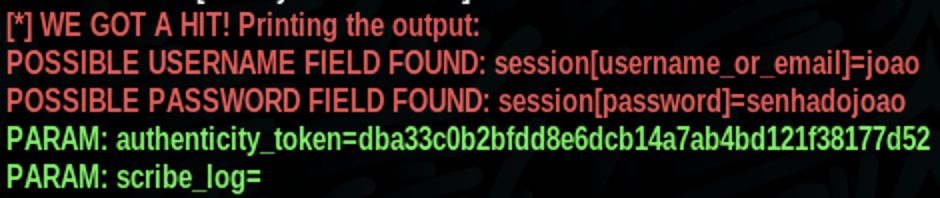

# Phishing com KALI Linux  🥷

Capturando dados (username e senha) de usuários através de uma página clonada similar ao Facebook utilizando SETOOLKIT.

SO: Kali Linux
Ferramenta: SETOOLKIT

(Desejável familiaridade com o terminal de comandos do sistema operacional Kali Linux.)

## Intruções:

1)Acesso root: digite "sudo su" no seu terminal ou use o emulador de terminal root do Kali.

2)Iniciando o SETOOLKIT: digite "setoolkit" no terminal.

3)Selecione o tipo de ataque: no menu apresentado encontre e digite no numero correspondente ao ataque, nesse caso "Social-Engineering Attacks" opção 1.

4)Escolha o vetor de ataque: no próximo menu, digite no numero correspondente ao vetor de ataque, dessa vez "Web Site Attack Vectors" opção 2.

5)Agora seleciona a opção 3 "Credential Harvester Attack Method".

6)Neste menu você pode selecionar a opção 1 e utilizar um template já existente ou a opção 2 "Site Clone" e escolher um site que deseja clonar para a colheita dos dados.

7)O próximo passo é escolher o IP para hospedar o clone, nesse caso o IP da sua máquina, e continuar pressionando Enter. (Você pode encontrar o seu IP utilizando o comando "ifconfig").

8)Pronto, o serviço está rodando e fará um POST com as credenciais inseridas no site clonado para o seu IP, e, ao apertar Ctrl+C para encerrar irá gerar um relatório em arquivo .xml.

## Resultados:

